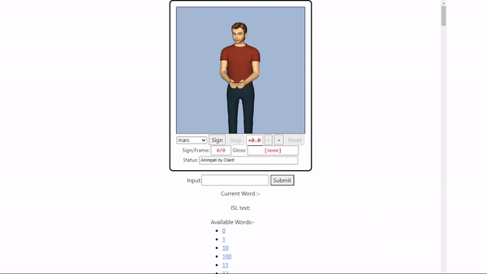

# Text to Indian Sign Language

A Summer project that will translate your text to Indian sign Language animations

# Demo

## Tech used

- Python
- Flask 
- Javascript
- [Stanza](https://stanfordnlp.github.io/stanza/)
- [Nltk](https://www.nltk.org/)
- [Stanford Parser](https://nlp.stanford.edu/software/lex-parser.shtml)
- [SIGML](https://vh.cmp.uea.ac.uk/index.php/SiGML)


## Installation
This project needs flask and python to run.

Install the dependencies and start the server.

```sh
pip install -r requirements.txt
python main.py
```
After running ```main.py``` stanford parser will be downloaded 
you may run into some errors related to classpath of java, google them they shouldn't be so hard to fix 
Open the browser and go to http://127.0.0.1:5000/  and see the project in action.

## NOTE
The project uses SIGML files for animating the words and they may not be accurate as making SIGML through HamNoSys is a long and tedious task and whoever made the sigml files which this project uses may not be accurate.


<h2 align="center"></h2>

<p align="center">
  
  
  
  
  
  
  
</p><br>

<h2 align="center">About Project</h2>

<p align="center">
 SLDP_Model project aiming to develop a web-based application to
  detect sign languages in real-time using  in order to enable speech-impaired people to communicate effectively.
</p>


<h2 align="center">Available Signs</h2>

<p align="center">
  
  
  
  
  
  
  
  
  
</p>

<p align="center">Bathroom │ Friend │ Hello	│ No │ Ok	│ Please │ Thank You │ Yes │ Special </p><br>

<h2 align="center">How to Use</h2>


```
npm i --force
```


```
npm start
```
